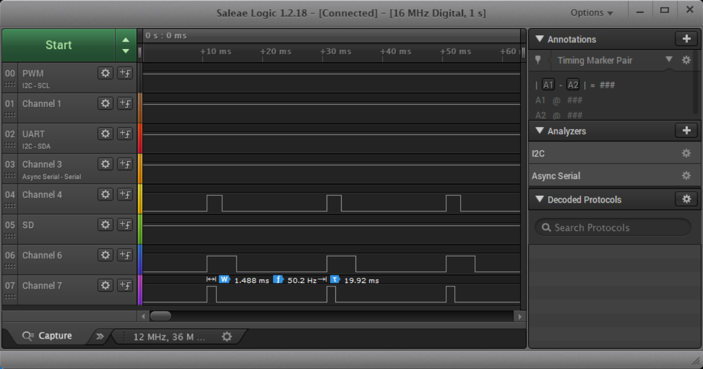

# pca9685 软件包

## 介绍

`pca9685` 软件包是针对通过 I2C 控制 PCA9685 产生16路 PWM 信号推出的一个软件包。使用这个软件包，可以在 RT-Thread 上非常方便的使用该器件，并且支持一个 I2C 总线上挂载多个 PCA9685。

本文主要介绍该软件包的使用方式、API，以及 `MSH` 测试命令。

### 目录结构

```
pca9685
|   img                             // 文档相关图片
|   doc                             // 相关文档
|   README.md                       // 软件包说明
|   pca9685.c                       // 源文件
|   pca9685.h                       // 头文件
|   pca9685_sample.c                // 软件包使用示例代码
|   SConscript                      // RT-Thread 默认的构建脚本
|   LICENSE                         // 许可证文件
```

### 许可证

pca9685 遵循 Apache-2.0 许可，详见 `LICENSE` 文件。

### 依赖

- RT_Thread 3.0+
- i2c 设备驱动

## 获取方式

使用 `pca9685 package` 需要在 RT-Thread 的包管理中选中它，具体路径如下：

```
RT-Thread online packages
    peripheral libraries and drivers  --->
        pca9685: I2C-bus controlled 16-channel PWM controller  --->
```

进入 pca9685 软件包的配置菜单按自己的需求进行具体的配置

```
    --- pca9685: I2C-bus controlled 16-channel PWM controller                           
        [*]   Enable pca9685 sample
           Version (latest)  --->
```

**Enable pca9685 sample** ：开启 pca9685  使用示例

配置完成后让 RT-Thread 的包管理器自动更新，或者使用 pkgs --update 命令更新包到 BSP 中。

## 使用方法

pca9685 软件包的使用流程一般如下：

1. 初始化 pca9685 设备 `pca9685_init`
2. 进行 PWM 的操作
   - 使用 API `pca9685_set_pwm` 设置单独一路 PWM 信号
   - 通过使能 `PWM_All_Call` 可以使得16路 PWM 信号周期相同

详细的使用方法可以参考[pca9685 示例程序](pca9685_sample.c) 。

## MSH 测试命令

如果开启了 pca9685 软件包的示例程序，就会导出 `pca9685_sample` 命令到控制台。调用之后默认会在 `i2c1`总线上探测地址为 `0x40` 的 PCA9685 设备，并会操作第 0 1 2 路 PWM 信号进行测试。运行结果如下：



## 注意事项

暂无。

## 联系方式

- 维护：[greedyhao](https://github.com/greedyhao)
- 主页：<https://github.com/greedyhao/pca9685>